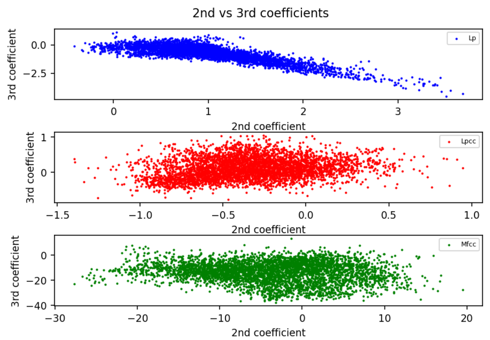
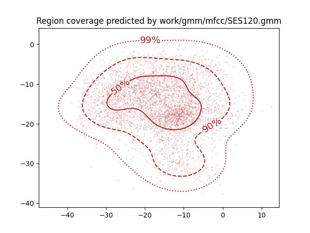
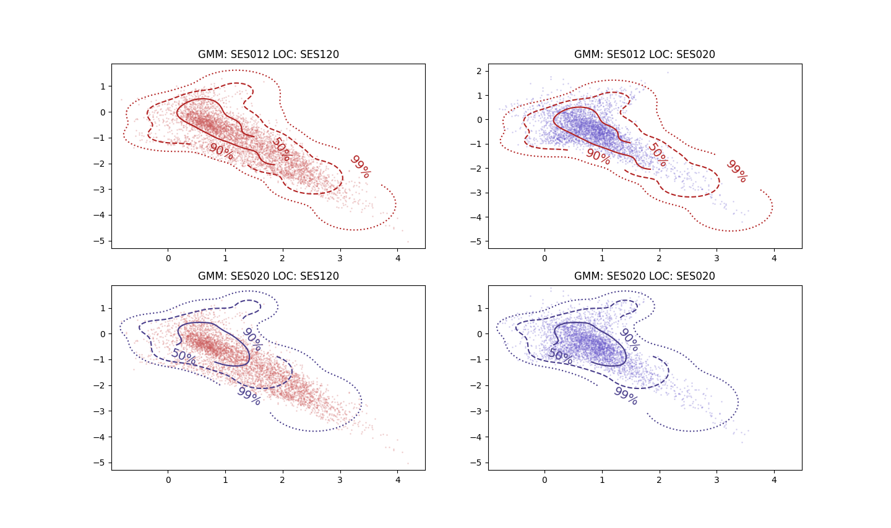
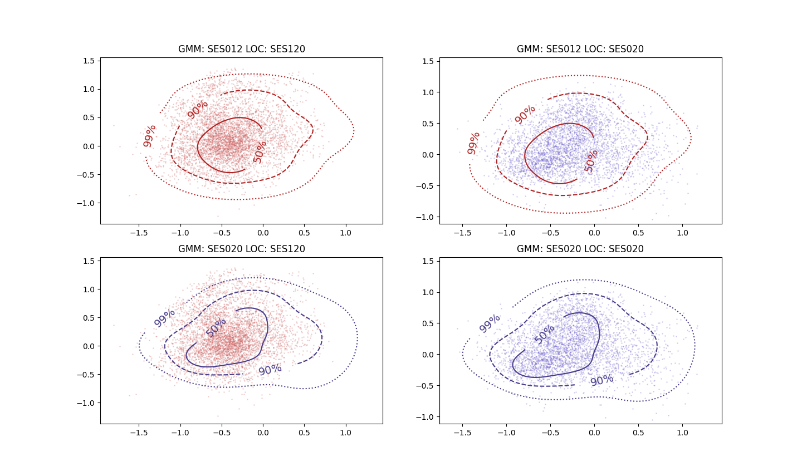
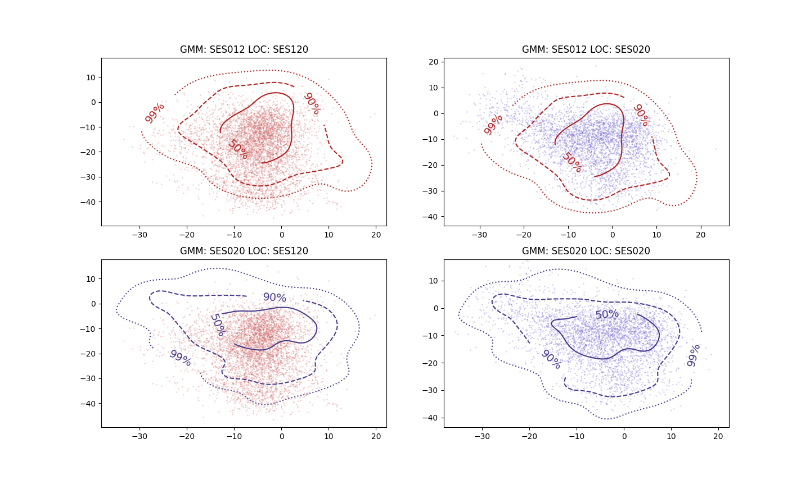

PAV - P4: reconocimiento y verificación del locutor
===================================================

Obtenga su copia del repositorio de la práctica accediendo a [Práctica 4](https://github.com/albino-pav/P4)
y pulsando sobre el botón `Fork` situado en la esquina superior derecha. A continuación, siga las
instrucciones de la [Práctica 2](https://github.com/albino-pav/P2) para crear una rama con el apellido de
los integrantes del grupo de prácticas, dar de alta al resto de integrantes como colaboradores del proyecto
y crear la copias locales del repositorio.

También debe descomprimir, en el directorio `PAV/P4`, el fichero [db_8mu.tgz](https://atenea.upc.edu/pluginfile.php/3145524/mod_assign/introattachment/0/spk_8mu.tgz?forcedownload=1)
con la base de datos oral que se utilizará en la parte experimental de la práctica.

Como entrega deberá realizar un *pull request* con el contenido de su copia del repositorio. Recuerde
que los ficheros entregados deberán estar en condiciones de ser ejecutados con sólo ejecutar:

~~~~~~~~~~~~~~~~~~~~~~~~~~~~~~~~~~~~~~~~~~~~~~~~~~~~~.sh
  make release
  run_spkid mfcc train test classerr verify verifyerr
~~~~~~~~~~~~~~~~~~~~~~~~~~~~~~~~~~~~~~~~~~~~~~~~~~~~~

Recuerde que, además de los trabajos indicados en esta parte básica, también deberá realizar un proyecto
de ampliación, del cual deberá subir una memoria explicativa a Atenea y los ficheros correspondientes al
repositorio de la práctica.

A modo de memoria de la parte básica, complete, en este mismo documento y usando el formato *markdown*, los
ejercicios indicados.

## Ejercicios.

### SPTK, Sox y los scripts de extracción de características.

- Analice el script `wav2lp.sh` y explique la misión de los distintos comandos involucrados en el *pipeline*
  principal (`sox`, `$X2X`, `$FRAME`, `$WINDOW` y `$LPC`). Explique el significado de cada una de las 
  opciones empleadas y de sus valores.

El pipeline principal es:  
``` bash
sox $inputfile -t raw -e signed -b 16 - | $X2X +sf | $FRAME -l 240 -p 80 | $WINDOW -l 240 -L 240 |
$LPC -l 240 -m $lpc_order > $base.lp
```
En primer lugar, se usa sox para convertir una señal ``inputfile`` (en este caso, en formato .wav) a tipo raw (sin headers) con ``-t raw``. Además, se usa una codificación con signo ``-e signed`` y cada muestra está cuantificada con 16 bits ``-b 16``. Esta conversión a raw es necesaria porque ``sptk`` trabaja directamente sobre el fichero de entrada sin diferenciar contenido de cabeceras o de datos, motivo por el cual hemos de eliminar la parte de cabeceras antes de tratarlo en ``sptk``.

Hecho esto, se usa un conjunto de comandos para tratar estos datos con SPTK. Lo primero es usar ``x2x`` para convertir los datos de short con signo a float ``+sf``. A continuación, entramamos la señal usando el comando ``frame`` con un tamaño de trama de 240 muestras/30 ms (``-l 240``) y un desplazamiento entre frames de 80 muestras (``-p 80``). Luego, se enventana la señal (``window``) indicando el tamaño de frame de la entrada (``-l 240``) y el de la salida, que es el mismo (``-L 240``). Al no estar indicando qué tipo de ventana queremos usar, por defecto sptk usa la ventana de *Blackman*. 

Una vez ya hemos entramado y enventanado la señal, solo queda obtener los coeficientes LPC, lo cual se hace con el comando ``lpc``. Se ha de indicar el tamaño de frame de entrada (``-l 240``) y el orden del LPC ``-m``, el cual en este caso lo indica el usuario. Este resultado se guarda en un fichero temporal ``$base.lp``.


- Explique el procedimiento seguido para obtener un fichero de formato *fmatrix* a partir de los ficheros de
  salida de SPTK (líneas 45 a 47 del script `wav2lp.sh`).

Las líneas donde se obtiene en formato *fmatrix* son:

``` bash
# Our array files need a header with the number of cols and rows:
ncol=$((lpc_order+1)) # lpc p =>  (gain a1 a2 ... ap) 
nrow=`$X2X +fa < $base.lp | wc -l | perl -ne 'print $_/'$ncol', "\n";'`

# Build fmatrix file by placing nrow and ncol in front, and the data after them
echo $nrow $ncol | $X2X +aI > $outputfile
cat $base.lp >> $outputfile
```
La primera cosa a tener en cuenta es que los ficheros *fmatrix* necesitan saber el número de filas y columnas de la matriz a construir.

En primer lugar, para obtener el número de columnas, lo podemos hacer de manera directa. Como sabemos el orden del lpc (introducido por el usuario, en este caso), ya podemos obtener el número de columnas, ya que será el número de coeficientes del lpc + 1 (se añade una posición para la ganancia). Esto se hace usando ``$((comando))``, que sirve para asignar el valor de la expresión aritmética de *comando* a la variable a la que se iguale.

Lo siguiente es obtener el número de filas, proceso más tedioso. Nuestro fichero de entrada es un conjunto de floats concatenados ``base.lp``. El primer paso es pasarlos a ASCII, lo cual nos generará una lista de números cada uno separado por un retorno de carro. Es decir, tendremos un valor en cada línea, lo cual se manda a ``wc``, que usando la opción ``-l`` obtiene el número de líneas que se le pasen (nuestro total de valores). Ahora que tenemos el número de valores de nuestro fichero, debido a que tiene siempre ``ncol`` columnas en todas las filas, podemos obtener el número de filas con el comando ``perl -ne 'print $_/'$ncol', "\n";'``. Este divide el valor pasado por la pipeline por la variable ``ncol`` (*total valores/total columnas*).

Ahora solo nos queda enviar esta información a un fichero de salida ``outputfile``. Para ello, pasamos a unsigned el valor de filas y columnas y lo escribimos en el inicio del fichero de salida. Por último, usando ``>>`` para hacer un *append*, añadimos los datos que contendrá la matriz a continuación de las filas y columnas que hemos escrito en el comando anterior.


  * ¿Por qué es conveniente usar este formato (u otro parecido)? Tenga en cuenta cuál es el formato de
    entrada y cuál es el de resultado.

  Si está en *fmatrix* podemos ver los contenidos en ascii usando ``fmatrix_show``. El fichero que tenemos de entrada es un conjunto de floats concatenados, los cuales no podemos interpretar directamente, ya que no están en ASCII ni ordenados según tramas/coeficientes. Gracias al formato *fmatrix* podemos además guardarnos los datos por filas o columnas combinando ``fmatrix_show`` y ``cut`` en un fichero de texto y que estén en un formato legible.

- Escriba el *pipeline* principal usado para calcular los coeficientes cepstrales de predicción lineal
  (LPCC) en su fichero <code>scripts/wav2lpcc.sh</code>:

``` bash
sox $inputfile -t raw -e signed -b 16 - | $X2X +sf | $FRAME -l 240 -p 80 | $WINDOW -l 240 -L 240 | $LPC -l 240 -m $lpc_order | $LPCC -m $lpc_order -M $lpcc_order > $base.lp
```

- Escriba el *pipeline* principal usado para calcular los coeficientes cepstrales en escala Mel (MFCC) en su
  fichero <code>scripts/wav2mfcc.sh</code>:

```bash
sox $inputfile -t raw -e signed -b 16 - | $X2X +sf | $FRAME -l 240 -p 80 | $WINDOW -l 240 -L 240 | $MFCC -s 8 -l 240 -m $mfcc_order -n $filter_bank_order > $base.mfcc
```

### Extracción de características.

- Inserte una imagen mostrando la dependencia entre los coeficientes 2 y 3 de las tres parametrizaciones
  para todas las señales de un locutor.
  
   <p align="center">
   
   </p>

  El código para realizar la gráfica se encuentra en ``plot_2nd_3rd_coeff.py``.

  + Indique **todas** las órdenes necesarias para obtener las gráficas a partir de las señales 
    parametrizadas.

  Debido al formato que se decide en ``wav2lp.sh``, la primera columna no nos proporciona información de los coeficientes, ya que es un contador de tramas. Además, hemos de tener en cuenta que la primera posición de datos, en el caso del LP y LPCC corresponde a la ganancia, con lo que nos quedaremos con la cuarta (segundo coeficiente considerando primer valor tras el contador el coeficiente 0 / ganancia) y quinta (tercer coeficiente) posición:

  ```bash
  fmatrix_show work/lp/BLOCK00/SES000/*.lp | egrep '^\[' | cut -f4,5 > lp_2_3.txt
  fmatrix_show work/lpcc/BLOCK00/SES000/*.lpcc | egrep '^\[' | cut -f4,5 > lpcc_2_3.txt
  fmatrix_show work/mfcc/BLOCK00/SES000/*.mfcc | egrep '^\[' | cut -f4,5 > mfcc_2_3.txt
  ```

  *Ejemplo del formato de una de las matrices:*
  `` [259]   2.74766 0.6672  ``**-0.792344**``       ``**-0.29209**``        -0.194822       0.140125        0.0747212       -0.0499551      -0.0134213   0.000352831     0.014067        0.013178        -0.0100912      -0.00950527``
  + ¿Cuál de ellas le parece que contiene más información?

  Vemos que en la gráfica la relación entre los coeficientes, en el caso LP se dispersan de una manera más o menos lineal. Es decir, al coeficiente 3 le corresponden valores bastante similares al coeficiente 2 según vamos variando su valor. Por otro lado, que en los otros dos casos (LPCC y MFCC) los coeficientes siguen una distribución más dispersa, con lo que podemos deducir que estos últimos están menos correlados que los LP. Es decir, la información que nos proporciona un coeficiente respecto al otro es más grande en LPCC/MFCC, ya que dependen menos uno del otro.

- Usando el programa <code>pearson</code>, obtenga los coeficientes de correlación normalizada entre los
  parámetros 2 y 3 para un locutor, y rellene la tabla siguiente con los valores obtenidos.

  |                        | LP   | LPCC | MFCC |
  |------------------------|:-----------------:|:-----------------:|:-----------------:|
  | &rho;<sub>x</sub>[2,3] | -0.818326 |0.217792|-0.134221|

  
  + Compare los resultados de <code>pearson</code> con los obtenidos gráficamente.

  Los resultados obtenidos con *Pearson* nos llevan a la misma conclusión  que antes: El coeficiente LPC toma valores próximos a 1 (alta correlación normalizada), mientras que los LPCC y MFCC están más próximos a 0 (baja correlación normalizada). 
  
  En resumen, los MFCC son los que tienen más información entre coeficientes, seguidos de cerca por los LPCC, y esto se refleja tanto en *pearson* como en las gráficas. Además, luego hemos visto que usando parámetros que hiciera que las parametrizaciones dispersaran más los datos generalmente proporcionaba mejores resultados, lo cual cuadra con lo que hemos visto en este apartado (menos correlación -> más información).

- Según la teoría, ¿qué parámetros considera adecuados para el cálculo de los coeficientes LPCC y MFCC?

  Para los LPCC:
    + Orden del LPCC: **13-16**

  Para los MFCC:
    + Número de filtros: **24-40**
    + Número de coeficientes: **13**


### Entrenamiento y visualización de los GMM.

Complete el código necesario para entrenar modelos GMM.

- Inserte una gráfica que muestre la función de densidad de probabilidad modelada por el GMM de un locutor
  para sus dos primeros coeficientes de MFCC.

  Por ejemplo, para el locutor 120 tenemos: 

  ```bash
  plot_gmm_feat -p 99,90,50 work/gmm/mfcc/SES120.gmm work/mfcc/BLOCK12/SES120/SA120S* --xDim 1 --yDim 0 &
  ```
  <p align="center">

  
  </p>

  Como se puede ver, la mezcla de gaussianas se adapta bastante bien a nuestros datos.

- Inserte una gráfica que permita comparar los modelos y poblaciones de dos locutores distintos (la gŕafica
  de la página 20 del enunciado puede servirle de referencia del resultado deseado). Analice la capacidad
  del modelado GMM para diferenciar las señales de uno y otro.

  Tras modificar ``plot_gmm_feat.py`` para admitir dos locutores y hacer los respectivos subplots, podemos ver los resultados que se obtienen para cada tipo de parametrización:
   
  **LP:** 
  ```bash
  plot_gmm_feat -p 99,90,50 work/gmm/lp/SES012.gmm work/lp/BLOCK12/SES120/SA120S* + work/lp/BLOCK02/SES020/SA020S* --gmm2 work/gmm/lp/SES020.gmm --xDim 2 --yDim 3 &
  ```
  <p align="center">

  
  </p>

  **LPCC:**
  ```bash
  plot_gmm_feat -p 99,90,50 work/gmm/lpcc/SES012.gmm work/lpcc/BLOCK12/SES120/SA120S* + work/lpcc/BLOCK02/SES020/SA020S* --gmm2 work/gmm/lpcc/SES020.gmm --xDim 2 --yDim 3 &
  ```
  <p align="center">

  
  </p>

  **MFCC:**
  ```bash
  plot_gmm_feat -p 99,90,50 work/gmm/mfcc/SES012.gmm work/mfcc/BLOCK12/SES120/SA120S* + work/mfcc/BLOCK02/SES020/SA020S* --gmm2 work/gmm/mfcc/SES020.gmm --xDim 2 --yDim 3 &
  ```
  <p align="center">

  
  </p>

  Una vez más, como hemos visto anteriormente, los coeficientes LP se dispersan de una manera algo lineal, lo cual causa que el modelado creado con la mezcla de gaussianas tenga una forma diagonal.

  En todos los casos se ve claro que la GMM correspondiente al locutor pertinente modela ligeramente mejor el locutor al que pertenece. Sobre todo en MFCC, se ve como incluso la orientación general de la GMM difiere en cada locutor, así como los contornos donde hay más concentración de muestras, con lo que podemos deducir que tendrá mayor facilidad para distinguir locutores.

### Reconocimiento del locutor.

Complete el código necesario para realizar reconociminto del locutor y optimice sus parámetros.

- Inserte una tabla con la tasa de error obtenida en el reconocimiento de los locutores de la base de datos
  SPEECON usando su mejor sistema de reconocimiento para los parámetros LP, LPCC y MFCC.

  |                        | LP   | LPCC | MFCC |
  |------------------------|:-----------------:|:-----------------:|:-----------------:|
  | # errores | 67 | 24 |5  |
  | **Tasa de error** | 8.54% | 3.06% | 0.64% |
  #### *Parámetros:*
    - *LP: 8 coeficientes*
    - *LPCC: 8 coeficientes LP, 13 coeficientes LPCC*
    - *MFCC: 16 coeficientes, 30 filtros*
    - *Para el entrenamiento: 62 gaussianas, 26 iteraciones, threshold=0.0001*

  Como hemos visto en las tareas anteriores, se cumple que usar una parametrización con MFCC mejora bastante los resultados del sistema.

  #### Acerca la inicialización
  Está claro que una mala inicialización aleatoria puede empeorar fácilmente los resultados según como funcione, pero, de todas formas, hemos logrado tasas de error bastante pequeñas con esta dada una inicialización aleatoria afortunada (hasta 8 errores).

  La inicialización con *EM_SPLIT* ha estado ligeramente modificada: como punto de partida se nos daba el método prácticamente hecho, pero hacía un split por defecto de las primeras gaussianas que encontrase (orden arbitrario en cuanto a los datos), lo cual, aun así, funcionaba bien, pero hacer los splits de las gaussianas con mayores varianzas puede proporcionar ligeramente mejores resultados. El código añadido es el siguiente (función ``split``):

  ```cpp
  std::vector<double> mean_sigma(old_size);

  //store the mean of the variance of each row in mean_sigma
  for (i = 0; i < old_size; i++)
  {
    mean_sigma[i] = 0;
    for (j = 0; j < vector_size; j++)

      mean_sigma[i] += (1 / (inv_sigma[i][j] + 0.00001)) * (1 / (inv_sigma[i][j] + 0.00001));
  }
  /* best way: select mixtures with larger variance (now, the first ones) */
  for (i = old_size; i < nmix; ++i)
  {
    //select j mixtures with the largest variance
    max = -1;
    for (unsigned int k = 0; k < old_size; k++)
    {
      if (mean_sigma[k] >= max)
      {
        max = mean_sigma[k];
        max_index = k;
      }
    }
    //discard value once it has been used
    mean_sigma[max_index] = -1;
    split_mixture(max_index, i);
  }
  ```
  De todas formas, el VQ ha sobrepasado este método por un error, y ha sido el que finalmente hemos terminado usando como inicialización. Además, a causa de que el método de ordenación/búsqueda de máximos para encontrar las gaussianas con mayor varianza no es muy eficiente, el método *em_split* ha sido el que ha tardado más tiempo.

  Otra observación es el uso de 16 coeficientes de MFCC en vez de 13. Gracias a esto hemos conseguido minimizar ligeramente algún error más que con 13, ya que tenemos más información. Se ha de considerar que quizás aumentar los datos de las parametrizaciones (añadiendo 3 coeficientes que no tienen tanta importancia) posiblemente cause que los resultados estén más optimizados respecto a la base de datos de entrenamiento que de cara a aplicaciones más genéricas.
  
### Verificación del locutor.

Complete el código necesario para realizar verificación del locutor y optimice sus parámetros.

- Inserte una tabla con el *score* obtenido con su mejor sistema de verificación del locutor en la tarea
  de verificación de SPEECON. La tabla debe incluir el umbral óptimo, el número de falsas alarmas y de
  pérdidas, y el score obtenido usando la parametrización que mejor resultado le hubiera dado en la tarea
  de reconocimiento.

  |                        | Resultados con MFCC |
  |------------------------|:-------------------------:|
  | Umbral óptimo | 0.493777196500208 |
  | # falsas alarmas | 0/1000=0.0000 |
  | # pérdidas | 38/250=0.1520 |
  | **SCORE** | 15.2 |

    #### *Parámetros:*
    - *MFCC: 16 coeficientes, 30 filtros*
    - *Para el entrenamiento: 50 gaussianas, 30 iteraciones, threshold=0.0001, 15 iteraciones para la inicialización*

    En esta segunda tarea hemos obtenido mejores resultados usando la inicialización *em_split*. Aun así, como en el caso anterior, el coste encontrado está **bastante** optimizado respecto la base de datos de entrenamiento: variando ligeramente las iteraciones de la inicialización, debido a la naturaleza de la función de costes, se obtienen fácilmente valores alrededor de 20%-35%, así que se pueden esperar peores resultados al usar esta misma optimización con otras bases de datos.


### Test final

- Adjunte, en el repositorio de la práctica, los ficheros `class_test.log` y `verif_test.log` 
  correspondientes a la evaluación *ciega* final.


  Para la tarea de reconocimiento de locutor, se han escogido parámetros algo más ligeros que los que daban mejores resultados con la base de entrenamiento. De todas formas, estos siguen funcionando bastante bien con la base de datos de prueba (*6 errores; tasa=0.76%*). Además, otro cambio que ha mejorado los resultados ha sido el uso de ventanas de *Hamming* al calcular los MFCC con menos coeficientes en vez de usar las de *Blackman* [[1]](https://citeseerx.ist.psu.edu/viewdoc/download?doi=10.1.1.483.2189&rep=rep1&type=pdf).
    - *MFCC: 13 coeficientes, 30 filtros*
    - *Para el entrenamiento: 50 gaussianas, 25 iteraciones, threshold=0.0001 e inicialización VQ*

  Por otro lado, para la verificación de locutor también hemos intentado usar parámetros que hicieran la tarea más genérica, aunque esto ha sido algo complicado. El reconocimiento de locutor era mucho más predictible de cara a seleccionar parámetros (p.ej. aumentar las gaussianas suele mejorar los resultados hasta llegar a cantidades concretas), pero en la verificación de locutor los cambios en el coste eran demasiado irregulares como para buscar una "zona segura" donde se mantuvieran constantes. Algo que sí hemos notado que mejoraba los resultados en la mayoría de experimentos ha sido el uso de *em_split* en vez de VQ. Los costes obtenidos con esta configuración estaban alrededor de 20%-25% (umbral = 0.7062612) con los datos de entrenamiento.

    - *MFCC: 13 coeficientes, 30 filtros*
    - *Para el entrenamiento: 41 gaussianas, 25 iteraciones, threshold=0.0001 e inicialización EM SPLIT de 15 iteraciones*


### Trabajo de ampliación.

- Recuerde enviar a Atenea un fichero en formato zip o tgz con la memoria (en formato PDF) con el trabajo 
  realizado como ampliación, así como los ficheros `class_ampl.log` y/o `verif_ampl.log`, obtenidos como 
  resultado del mismo.
